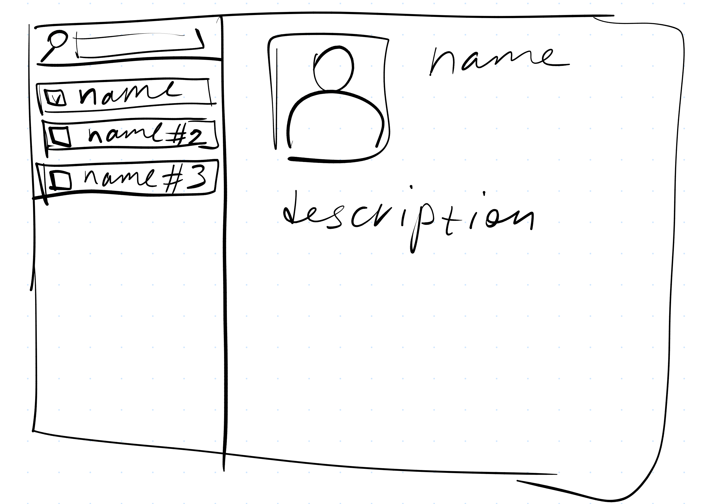
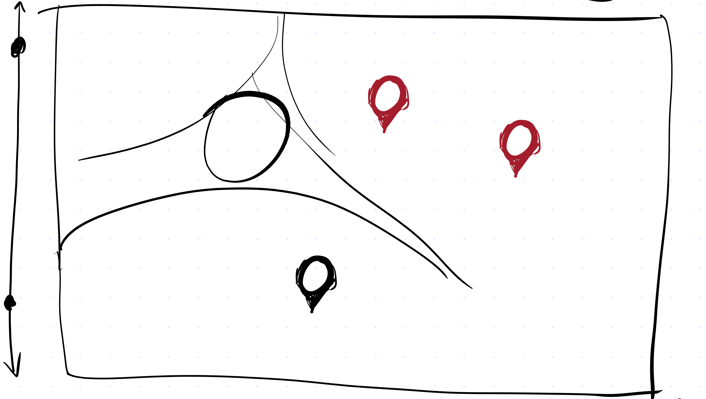
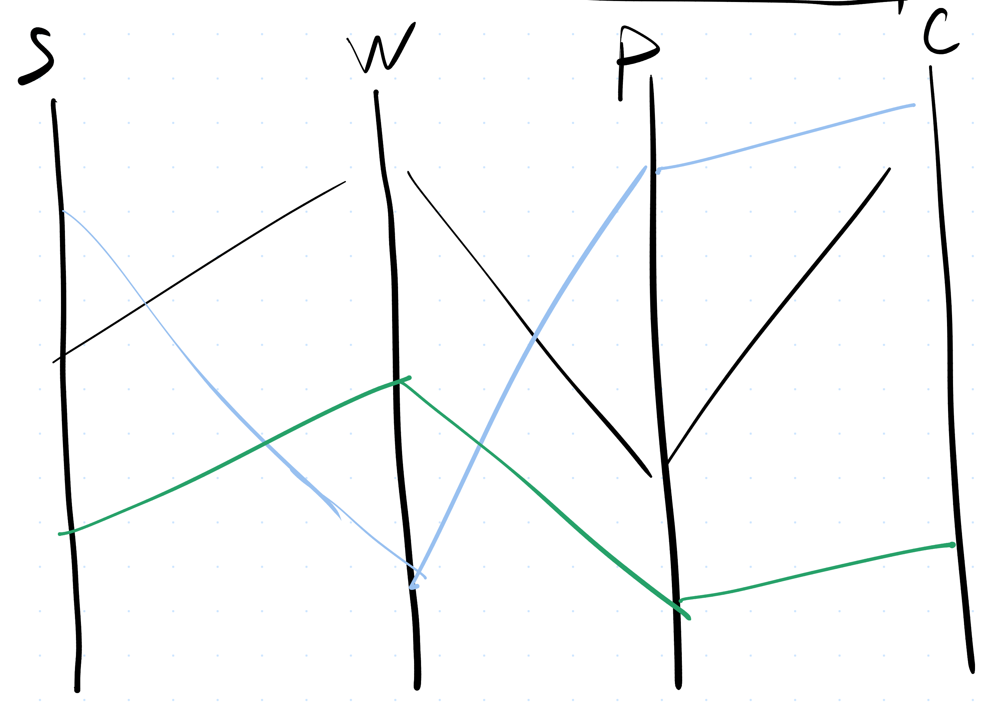

# Project of Data Visualization (COM-480)

| Student's name | SCIPER |
| -------------- | ------ |
| Anna Lavrenko  | 389025 |
| Dmitrii Litvin | 395705 |
| Vladimir Melnikov| 390273 |

[Milestone 1](#milestone-1) • [Milestone 2](#milestone-2) • [Milestone 3](#milestone-3)

## Milestone 1 (21st March, 5pm)

**10% of the final grade**

[Naruto](https://en.wikipedia.org/wiki/Naruto_(TV_series)) is a Japanese anime television series based on Masashi Kishimoto's manga series of the same name. The story follows Naruto Uzumaki, a young ninja who seeks recognition from his peers and dreams of becoming the Hokage, the leader of his village. “Naruto Shippuden” is considered the main series and consists of 500 20-minute episodes in total. 


### Dataset

We explored numerous datasets available on Kaggle and other sources but none of them contained any data beyond the list of episodes with corresponding rankings.
This type of table data is quite constraining for the purposes of interesting visualisations immersing into the fictional world of Naruto. Fortunately, fandom wikis are an extensive source of knowledge about such universes.
 
In short, our data comes from 3 main sources:
 - [Chatacter Statistics](https://naruto.fandom.com/ru/wiki/%D0%9F%D0%B0%D1%80%D0%B0%D0%BC%D0%B5%D1%82%D1%80_%D0%A1%D0%BF%D0%BE%D1%81%D0%BE%D0%B1%D0%BD%D0%BE%D1%81%D1%82%D0%B5%D0%B9) from the Russian fandom page (translated with a script)
 - [Summary of all episodes](https://naruto.fandom.com/wiki/The_New_Target) from the English wiki from which we extracted information about the battles (counterparties, location, outcome)
 - [Characters’ story lines](https://naruto.fandom.com/wiki/The_New_Target) scraped from the English wiki (e.g. hometown)
 - Generated data with the use of the above

Obviously the data on the wiki pages is not structured, so after scraping and cleaning we used a local LLM to generate shorter summaries and extract necessary entities in the yaml format. The locations on the map had to be marked manually. Our domain knowledge expert assessed the quality of mined data as fairly accurate.


### Problematic

The goal of the website is the visualization of data for the “Naruto” series. The website provides the series’ audience and fans with information on the characters (descriptions, hometowns, statistics) and the battles from the series (locations, co-occurrence matrix).

Target Audience: The audience and the fans of the series

Overview: 
1. Character cards with a short description and a picture 
2. A map of the world with pins corresponding to the chosen characters’ hometowns 
3. Character statistics visualized
Each character has its own color and the attributes are placed on the axes. There are three visualizations, each for one of the three books that correspond to certain timelines. The characters’ characteristics can be compared across the same attributes during one time period. \
Attribute list: Ninjutsu, Taijutsu, Genjutsu, Intelligence, Strength, Speed, Chakra (Stamina), Hand seals \
Scale: 0 - 5 

4. Co-occurrence matrix of battle opponents \
Co-occurrence matrix for the main characters (from the character statistics table) to reflect the frequency of battles between them.

5. Battle Density Map \
Visualization of a density map of all the battles that happened in the series between all of the characters.


### Exploratory Data Analysis

Data from official databooks:
There are 3 official databooks Rin no Sho, Too no Sho, Sha no Sho
| book       | characters |
|------------|-----|
| Rin no Sho | 33  |
| Too no Sho | 35  |
| Sha no Sho | 33  |

These 3 books have 57 characters in total

Each character has 8 attributes: 

| Attribute    | Mean |
|--------------|------|
| Ninjutsu     | 3.11 |
| Taijutsu     | 2.8  |
| Genjutsu     | 2.41 |
| Intelligence | 2.95 |
| Strength     | 2.42 |
| Speed        | 2.98 |
| Stamina      | 2.62 |
| Hand seals   | 3.06 |

Scale: /5.0

Generated data is made from 500 episodes with their description taken from [fandom website](https://naruto.fandom.com/) . In the generated data there occur 69 distinct locations, 552 distinct names, and 458 battles.

We loaded 93MB of web pages with description of episodes. They were later cut to 2.8MB by cutting everything except summaries. This data was loaded to the model by episode, and the descriptions of the battles were generated based on it.
After all the steps of cleaning, modifying and fixing this data we got a yaml file with the description of all the battles in the following format:
```yaml
- episode_number: "2"
  opponents:
    - ["Naruto Uzumaki", "Sakura Haruno"]
    - ["Kakashi Hatake"]
  outcome: "The battle is interrupted before a clear winner is determined, focusing on assessing Naruto and Sakura's growth after training with the Sannin."
  description: "Kakashi puts Naruto and Sakura through a retake of the bell test to gauge their progress, utilizing his Sharingan to challenge them despite their increased strength from training with Jiraiya and Tsunade."
  closest_village: "Konohagakure"
```

Several records were taken from this file to manually check that these battles occured in the series and were not just a hallucination of the LLM.

Character descriptions were taken directly from websites and later compressed by LLM.

Birth places were also generated by LMM but then were fully reviewed and checked manually (possible due to the comparatively small length). All the 57 main characters are from one of the 8 villages. Here is the list of the villages:

| Otogakure | Konohagakure | Sunagakure | Takigakure | Yugakure | Iwagakure | Kirigakure | Unknown |
|-----------|--------------|---------|------------|----------|-----------|-------------|-------------|

### Related work


- What others have already done with the data? Why is your approach original? \
\
There is a lot of descriptive data for the series that can be found on various websites, including separate web pages for each character and episode descriptions. \
\
However, we have not found any statistical analysis or visualizations of the statistics done for the series. Our website will allow the users to compare the characters’ statistics and will provide insights into things like: the distribution of the characters’ hometowns, battle locations’ density, and the frequency of battles between the main characters. Moreover, it will offer precise and easily accessible character descriptions in the cards.

- What source of inspiration do you take? \
\
Visualizations that you found on other websites or magazines (might be unrelated to your data). 
    - Co-occurrence Matrix inspired by Lecture 4
    - Statistics’ Visualization inspired by the Pokemons Project


## Milestone 2 (18th April, 5pm)

### Website MVP Link


### Project Overview

Our project consists of **4 core visualizations**, each of which can be developed simultaneously by the team members. Below we list each visualization along with the necessary tools and additional ideas.

---

### 1. Battle Co-occurrence Matrix 🥷⚔

#### Data Storytelling
- Rows and columns represent characters.
- Cells represent battles where these characters fought against each other.

#### Tools
- Example: [Les Misérables co-occurrence matrix](https://bost.ocks.org/mike/miserables/)
- Libraries: `d3.v2.min.js`, `analytics.js`

#### Ideas
- **Brushing**: Show the exact number of fights between characters when hovering over a cell.
- **Potential addition**: Display descriptions of major battles when relevant.

---

### 2. Map 🗺

#### Data Storytelling
- The map provides spatial insights into key events in the series, such as battles and character birthplaces.

#### Tools
- Lectures and exercises on maps

**Note**: Since our map is fictional, we cannot rely on public APIs with real-world geodata. However, we aim to make the map highly interactive.

#### Ideas
- **Brushing**: Display the list of characters born in the selected village.
- **Aggregation**: Use color intensity to represent the number of battles in each village (battle density map).

---

### 3. Character Statistics 📊

#### Data Storytelling
- Visualizing character statistics across different time periods (specifically, 3 official books for different time periods) gives insight into how their abilities evolve over time and help compare the characters to each other.

#### Tools
- D3 examples repository
- Libraries: `d3.min.js`

#### Ideas
- **Filtering**: Allow users to select a subset of characters (e.g., via checkboxes) to reduce visual noise.

---

### 4. Character Cards (Profiles) 🪪

#### Data Storytelling
- Profiles of the main characters featuring their pictures and short biographies.

#### Tools

#### Ideas

### Milestone 3 (30th May, 5pm)

**80% of the final grade**


## Late policy

- < 24h: 80% of the grade for the milestone
- < 48h: 70% of the grade for the milestone
